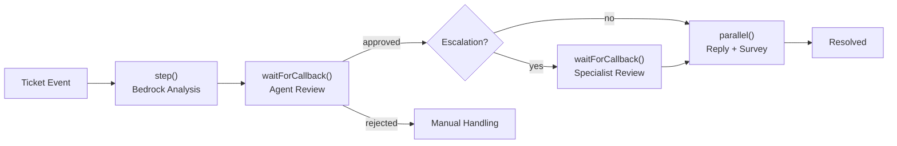

# durable-support-triage

AI-powered support ticket triage built with [AWS Lambda Durable Functions](https://docs.aws.amazon.com/lambda/latest/dg/durable-functions.html) and Amazon Bedrock. Demonstrates how durable execution primitives (steps, callbacks, and parallel branches) compose into a human-in-the-loop workflow that can run for days while only paying for compute during active work.

Blog post: [AWS Lambda Durable Functions: Building Long-Running Workflows in Code](https://dev.to/gunnargrosch)

## How it works

Submit a support ticket as a JSON event. The function analyzes it with Claude, suspends for human review, optionally escalates, then closes out. The entire workflow runs in a single function for up to 7 days.



Each ticket follows a different path depending on the AI's triage. During `waitForCallback` suspensions, the function stops executing and compute charges stop. It resumes exactly where it left off when the callback arrives, whether that's minutes, hours, or days later.

## Durable primitives used

| Primitive | Where |
| --- | --- |
| `step()` with retry | Bedrock AI analysis with exponential backoff and jitter |
| `waitForCallback()` | Agent review (8h timeout), specialist review (3d timeout) |
| `parallel()` | Customer reply + satisfaction survey sent concurrently |
| `context.logger` | Replay-aware structured logging throughout |

## Prerequisites

- An AWS account with Amazon Bedrock access to **Claude Haiku 4.5**
- [AWS SAM CLI](https://docs.aws.amazon.com/serverless-application-model/latest/developerguide/install-sam-cli.html) 1.153.1 or later
- Node.js 24+
- AWS credentials configured (`AWS_PROFILE` or default)

## Getting started

```bash
git clone https://github.com/gunnargrosch/durable-support-triage.git
cd durable-support-triage
npm install
npm run demo
```

## Interactive demo

Run `npm run demo` to start the interactive demo. This opens a menu where you pick a mode (local or cloud), a ticket scenario, and (for cloud mode) your AWS profile and region. You play the support agent and, if escalation is triggered, the specialist.

Three ticket scenarios are included:

| Scenario | Tier | What happens |
| --- | --- | --- |
| `standard` | pro | CSV export bug, agent review, resolved |
| `escalation` | enterprise | Security concern, agent + specialist review, escalated |
| `billing` | free | Duplicate charge, agent review, resolved |

To skip the menu, pass the mode and scenario directly:

```bash
npm run demo:local -- --ticket=standard
npm run demo:cloud -- --ticket=escalation --profile=my-profile --region=us-east-1
```

`demo:local` uses mocked Bedrock responses and runs entirely offline. `demo:cloud` invokes the deployed Lambda function with real Bedrock calls. The `DemoCommand` stack output shows the exact cloud command with your function name and region.

Cloud mode accepts these additional flags:

| Flag | Description |
| --- | --- |
| `--profile=<name>` | AWS CLI profile to use |
| `--region=<region>` | AWS region (overrides profile/env default) |
| `--function-name=<name>` | Lambda function name (defaults to `FunctionName` from `template.yaml`) |

## Deploy

```bash
sam build
sam deploy --guided
```

## Direct invocation

You can also invoke the function and send callbacks directly via the AWS CLI. Replace `<your-function-name>` with the `FunctionArn` output from your stack (or use the function name from `DemoCommand`):

```bash
aws lambda invoke \
  --function-name <your-function-name>:live \
  --invocation-type Event \
  --durable-execution-name "ticket-TKT-001" \
  --cli-binary-format raw-in-base64-out \
  --payload '{"ticketId":"TKT-001","customerId":"CUST-123","customerTier":"pro","subject":"Cannot export CSV reports","body":"Export button not working.","contactEmail":"customer@example.com"}' \
  response.json
```

When the function suspends at a callback, send the agent's review:

```bash
aws lambda send-durable-execution-callback-success \
  --callback-id "<callback-id-from-execution-history>" \
  --cli-binary-format raw-in-base64-out \
  --result '{"approved":true,"editedResponse":"","agentNotes":"Known bug, fix deploying."}'
```

## Testing

```bash
npm test     # Unit tests (mocked Bedrock, local durable test runner)
npm run lint # ESLint
```

## Project structure

```text
src/
  index.ts               # Lambda handler, durable execution workflow
  index.test.ts          # Unit tests with LocalDurableTestRunner
scripts/
  demo.ts                # Interactive demo, local (mocked) and cloud (real Lambda)
template.yaml            # SAM template, function, IAM, Bedrock permissions
```

## Design decisions

**Single function, not a state machine.** The entire workflow lives in one function using `withDurableExecution`. Steps, callbacks, and parallel branches are expressed as code, not JSON configuration. The SDK handles checkpointing, replay, and resume.

**RISEN system prompt.** The Bedrock analysis uses a [RISEN-structured prompt](https://dev.to/gunnargrosch/writing-system-prompts-that-actually-work-the-risen-framework-for-ai-agents-4p94) with explicit escalation rules in the Narrowing section. This prevents the model from over-escalating standard tickets.

**Human-in-the-loop via callbacks.** `waitForCallback()` suspends the function and stops compute. The callback ID is passed to a ticketing system (or the demo script) so a human can review and respond. No polling, no idle compute.

**Parallel close-out.** Customer reply and satisfaction survey are sent concurrently using `parallel()`. Both branches are checkpointed independently.

**Stub integrations.** `notifyAgent`, `notifySpecialist`, `sendCustomerReply`, and `sendSatisfactionSurvey` log their parameters but don't send anything. The demo script simulates the callback lifecycle via the CLI. In production, replace with SES, SNS, Slack, or your ticketing system.

## Cost

A ticket that suspends for 24 hours at a callback costs approximately $0.0001 in Lambda compute, since you only pay for the brief periods of active execution (analysis, sending replies), not the hours or days of waiting. Bedrock charges apply separately for the AI analysis step.

## Production considerations

This is a demo. If you use it as a starting point for a production workflow, consider the following:

- **Dead-letter queue.** Add a DLQ or failure destination to catch executions that exhaust retries or fail unexpectedly. Without one, failed tickets are only visible in CloudWatch Logs.
- **Callback timeouts.** The agent review times out after 8 hours and the specialist review after 3 days. When a timeout expires, the execution fails with a timeout error. Add monitoring or alerting on execution failures so timed-out tickets get manual follow-up.
- **Alarms.** The template deploys no CloudWatch alarms. Add at least an alarm on the `Errors` metric so you get notified when executions fail.
- **Prompt management.** The system prompt is inlined in the handler. Production systems typically store prompts in S3, Parameter Store, or a prompt management service so they can be versioned and updated without redeploying code.

## License

MIT
